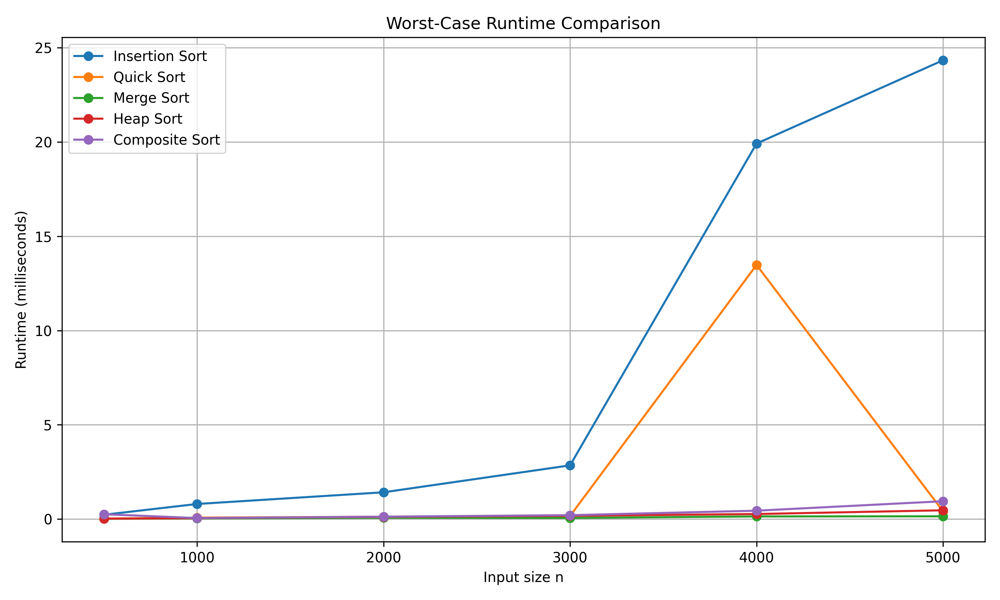
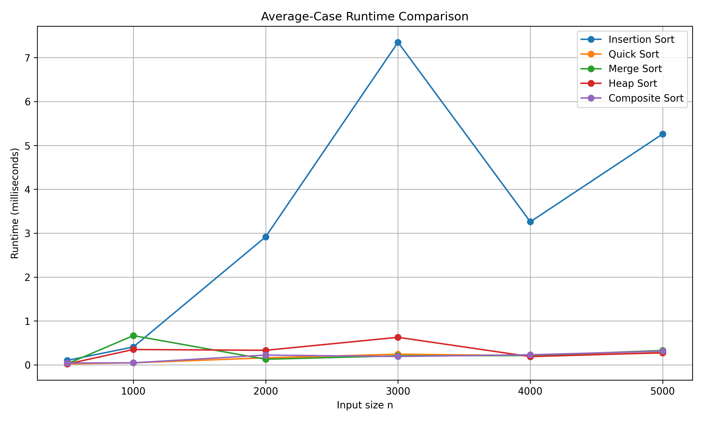

# 排序法效能比較與 Composite Sort 實作報告

> 雙人合作報告  
> 組員 A：鄭亦閔 學號:41343147
> 組員 B：周子新  

---

## 一、解題說明

本專題要求實作並比較四種排序法：

1. Insertion Sort
2. Quick Sort with median-of-three
3. Iterative Merge Sort
4. Heap Sort

本作業的主要目標不是只有寫出排序程式，而是要透過實際測試，觀察四種排序法在不同資料量 `n` 下的執行時間，並根據測試結果設計一個 **Composite Sort** 函式。

Composite Sort 的概念是：

> 根據輸入資料量大小，自動選擇當下較適合的排序法，以取得較好的整體效能。

---

## 二、雙人分工說明

本專題採雙人合作方式完成，分工如下：

| 組員 | 負責內容 | 具體工作 |
|---|---|---|
| 組員 A | 程式實作與測試整合 | 實作四種排序法、資料產生器、測速主程式、Composite Sort 函式、確認程式可編譯執行 |
| 組員 B | 實驗紀錄與報告整理 | 整理測試資料、製作 CSV 表格、產生圖表、撰寫效能分析、整理 GitHub README 與報告內容 |

### 組員 A 詳細工作

1. 實作 Insertion Sort。
2. 實作 Quick Sort，並使用 median-of-three 選擇 pivot。
3. 實作 Iterative Merge Sort。
4. 實作 Heap Sort。
5. 實作資料產生器：
   - 反向資料
   - 隨機排列資料
   - Merge Sort worst-case 資料
6. 撰寫主程式進行測速。
7. 確認所有排序法排序結果正確。

### 組員 B 詳細工作

1. 整理 worst-case 測試結果。
2. 整理 average-case 測試結果。
3. 將測試結果輸出成 CSV。
4. 使用 Python 產生折線圖。
5. 撰寫報告中的測試與驗證、效能分析、申論及開發報告。
6. 整理 GitHub 專案架構與 README。

---

## 三、解題策略

本專題的解題流程如下：

1. 先完成四種排序法的 C++ 程式。
2. 使用小型測試資料確認排序結果是否正確。
3. 對不同資料量進行測試：

   ```text
   n = 500, 1000, 2000, 3000, 4000, 5000
   ```

4. 分別進行：
   - worst-case runtime 測試
   - average-case runtime 測試

5. 將測試結果輸出為 CSV。
6. 根據 CSV 資料製作圖表。
7. 根據實驗結果設計 Composite Sort。
8. 將程式碼、測試資料、圖表與報告整理後上傳 GitHub。

---

## 四、程式實作

本專案程式碼放在 `src/` 資料夾中。

| 檔案 | 功能 |
|---|---|
| `src/main.cpp` | 主程式，負責執行測試與輸出結果 |
| `src/sorting.h` | 排序函式宣告 |
| `src/sorting.cpp` | 四種排序法與 Composite Sort 實作 |
| `src/data_generator.h` | 測試資料產生器宣告 |
| `src/data_generator.cpp` | 測試資料產生器實作 |

### 4.1 Insertion Sort

Insertion Sort 的核心想法是：

> 將每一個元素插入到前面已排序區間中的正確位置。

其 worst-case 會發生在資料為反向排序時，例如：

```text
5, 4, 3, 2, 1
```

時間複雜度：

```text
Worst Case: O(n^2)
Average Case: O(n^2)
Best Case: O(n)
```

---

### 4.2 Quick Sort with Median-of-Three

Quick Sort 使用分割的方式，選擇一個 pivot，將比 pivot 小的元素放左邊，比 pivot 大的元素放右邊，再分別處理左右子陣列。

本專案使用 **median-of-three** 方法選擇 pivot。

median-of-three 是從：

```text
left, middle, right
```

三個位置中選出中位數作為 pivot，以降低遇到極端分割的機率。

時間複雜度：

```text
Worst Case: O(n^2)
Average Case: O(n log n)
Best Case: O(n log n)
```

---

### 4.3 Iterative Merge Sort

Merge Sort 的想法是將資料分成小區塊後進行合併。

本專案使用 iterative method，也就是非遞迴版本。

時間複雜度：

```text
Worst Case: O(n log n)
Average Case: O(n log n)
Best Case: O(n log n)
```

---

### 4.4 Heap Sort

Heap Sort 先將資料建立成 max heap，接著反覆取出最大值並放到陣列尾端。

時間複雜度：

```text
Worst Case: O(n log n)
Average Case: O(n log n)
Best Case: O(n log n)
```

---

### 4.5 Composite Sort

Composite Sort 會根據資料量選擇排序法。

目前範本程式中的預設策略為：

```cpp
void compositeSort(vector<int>& arr)
{
    int n = static_cast<int>(arr.size());

    if (n <= 32)
    {
        insertionSort(arr);
    }
    else
    {
        quickSort(arr, 0, n - 1);
    }
}
```

根據本次測試結果，如果以 worst-case criterion 為主，建議改成：

```text
n <= 32：使用 Insertion Sort
n > 32：使用 Merge Sort
```

如果以 average-case criterion 為主，建議維持：

```text
n <= 32：使用 Insertion Sort
n > 32：使用 Quick Sort
```

---

## 五、效能分析

### 5.1 理論時間複雜度比較

| 排序法 | Best Case | Average Case | Worst Case |
|---|---:|---:|---:|
| Insertion Sort | O(n) | O(n^2) | O(n^2) |
| Quick Sort | O(n log n) | O(n log n) | O(n^2) |
| Merge Sort | O(n log n) | O(n log n) | O(n log n) |
| Heap Sort | O(n log n) | O(n log n) | O(n log n) |

### 5.2 空間複雜度比較

| 排序法 | 空間複雜度 | 說明 |
|---|---:|---|
| Insertion Sort | O(1) | 原地排序 |
| Quick Sort | O(log n) | 遞迴呼叫堆疊，平均情況 |
| Iterative Merge Sort | O(n) | 需要暫存陣列 |
| Heap Sort | O(1) | 原地排序 |

---

## 六、測試與驗證

### 6.1 測試環境

| 項目 | 內容 |
|---|---|
| 程式語言 | C++ |
| 編譯標準 | C++17 |
| 編譯器 | g++ |
| 最佳化參數 | `-O2` |
| 計時工具 | `std::chrono::high_resolution_clock` |
| 時間單位 | milliseconds |

### 6.2 正確性測試

在正式測速前，先使用以下資料測試每個排序法是否能正確排序：

```text
5, 1, 4, 2, 3
```

預期輸出：

```text
1, 2, 3, 4, 5
```

測試結果：

```text
Correctness test passed.
```

代表四種排序法與 Composite Sort 都能正確完成排序。

---

### 6.3 Worst-case 測試方式

不同排序法的 worst-case 測試資料如下：

| 排序法 | worst-case 測試方式 |
|---|---|
| Insertion Sort | 使用反向排序資料 |
| Quick Sort | 使用多組隨機排列，取最大執行時間近似 worst-case |
| Merge Sort | 使用自訂 worst-case 產生器 |
| Heap Sort | 使用多組隨機排列，取最大執行時間近似 worst-case |

本專案對 Quick Sort 與 Heap Sort 每個 `n` 至少測試 10 組隨機排列，並取其中最大值。

---

### 6.4 Average-case 測試方式

Average-case 測試使用隨機排列資料。

每個 `n` 產生多組隨機排列，分別執行排序後計算平均執行時間。

---

## 七、測試結果

### 7.1 Worst-case Runtime Results

單位：milliseconds

| n | Insertion Sort | Quick Sort | Merge Sort | Heap Sort | Composite Sort |
|---:|---:|---:|---:|---:|---:|
| 500 | 0.050225 | 0.022920 | 0.011220 | 0.030225 | 0.019665 |
| 1000 | 0.194319 | 0.046449 | 0.022444 | 0.061539 | 0.046473 |
| 2000 | 0.760190 | 0.098457 | 0.047593 | 0.132262 | 0.102048 |
| 3000 | 1.741747 | 0.152379 | 0.088672 | 0.213064 | 0.155376 |
| 4000 | 3.005491 | 0.215054 | 0.107682 | 0.300559 | 0.241939 |
| 5000 | 4.713037 | 0.272737 | 0.126219 | 0.360478 | 0.270292 |

### 7.2 Worst-case 觀察

- n = 500 時，最快的是 Merge Sort，時間約 0.011220 ms。
- n = 1000 時，最快的是 Merge Sort，時間約 0.022444 ms。
- n = 2000 時，最快的是 Merge Sort，時間約 0.047593 ms。
- n = 3000 時，最快的是 Merge Sort，時間約 0.088672 ms。
- n = 4000 時，最快的是 Merge Sort，時間約 0.107682 ms。
- n = 5000 時，最快的是 Merge Sort，時間約 0.126219 ms。

整體來看，Insertion Sort 在資料量增加時成長速度明顯較快，符合 `O(n^2)` 的特徵。Merge Sort 在 worst-case 測試中表現穩定，且本次實測結果中大多數資料量下具有最佳表現。

---

### 7.3 Average-case Runtime Results

單位：milliseconds

| n | Insertion Sort | Quick Sort | Merge Sort | Heap Sort | Composite Sort |
|---:|---:|---:|---:|---:|---:|
| 500 | 0.029756 | 0.019443 | 0.022907 | 0.027657 | 0.020259 |
| 1000 | 0.105958 | 0.041981 | 0.054551 | 0.059232 | 0.043399 |
| 2000 | 0.399466 | 0.094680 | 0.110968 | 0.129027 | 0.092205 |
| 3000 | 0.862553 | 0.143264 | 0.170621 | 0.200064 | 0.145327 |
| 4000 | 1.523712 | 0.200158 | 0.233865 | 0.281654 | 0.198888 |
| 5000 | 2.321958 | 0.254527 | 0.303715 | 0.348907 | 0.258944 |

### 7.4 Average-case 觀察

- n = 500 時，最快的是 Quick Sort，時間約 0.019443 ms。
- n = 1000 時，最快的是 Quick Sort，時間約 0.041981 ms。
- n = 2000 時，最快的是 Composite Sort，時間約 0.092205 ms。
- n = 3000 時，最快的是 Quick Sort，時間約 0.143264 ms。
- n = 4000 時，最快的是 Composite Sort，時間約 0.198888 ms。
- n = 5000 時，最快的是 Quick Sort，時間約 0.254527 ms。

整體來看，Quick Sort 在 average-case 測試中表現良好，符合其平均時間複雜度 `O(n log n)` 的特徵。

---

## 八、圖表說明

本專案將測試結果繪製成折線圖，圖表存放在 `charts/` 資料夾中。

| 圖表 | 檔案位置 |
|---|---|
| Worst-case Runtime Chart | `charts/worst_case_chart.png` |
| Average-case Runtime Chart | `charts/average_case_chart.png` |

在 GitHub 的 README 中可以使用以下語法顯示圖表：

```markdown



```

---

## 九、編譯與執行指令

### 9.1 使用 Makefile 編譯

```shell
$ make
```

執行：

```shell
$ ./sorting_project
```

---

### 9.2 Windows PowerShell 編譯

如果在 Windows 上沒有使用 Makefile，可以直接輸入：

```shell
$ g++ -std=c++17 -O2 src/main.cpp src/sorting.cpp src/data_generator.cpp -o sorting_project.exe
```

執行：

```shell
$ ./sorting_project.exe
```

---

### 9.3 產生圖表

需要先安裝 Python 與 matplotlib：

```shell
$ pip install matplotlib
```

產生圖表：

```shell
$ cd scripts
$ python generate_charts.py
```

---

## 十、GitHub 專案內容

本專案上傳至 GitHub 時，建議保留以下結構：

```text
sorting-project/
│
├── README.md
├── Makefile
├── src/
│   ├── main.cpp
│   ├── sorting.h
│   ├── sorting.cpp
│   ├── data_generator.h
│   └── data_generator.cpp
│
├── data/
│   ├── worst_case_results.csv
│   └── average_case_results.csv
│
├── charts/
│   ├── worst_case_chart.png
│   └── average_case_chart.png
│
├── report/
│   └── sorting_project_report_zh.md
│
└── scripts/
    └── generate_charts.py
```

---

## 十一、結論

本專題完成了四種排序法的實作與效能比較。

根據 worst-case 測試結果：

1. Insertion Sort 在資料量變大後執行時間明顯增加。
2. Merge Sort 的 worst-case 表現穩定，且本次實測結果中表現最好。
3. Heap Sort 同樣具有 `O(n log n)` 的 worst-case 複雜度，但本次實測時間略高於 Merge Sort。
4. Quick Sort 雖然使用 median-of-three，但在 worst-case criterion 下仍需注意可能退化成 `O(n^2)`。

根據 average-case 測試結果：

1. Quick Sort 在隨機資料下表現良好。
2. Merge Sort 表現穩定，但因為需要額外暫存陣列，實際執行時間可能略高於 Quick Sort。
3. Heap Sort 的理論時間複雜度穩定，但實測結果通常不一定比 Quick Sort 快。
4. Insertion Sort 適合小資料量，不適合大量資料。

因此，本專案建議：

```text
如果以 worst-case criterion 為主：
n <= 32：使用 Insertion Sort
n > 32：使用 Merge Sort

如果以 average-case criterion 為主：
n <= 32：使用 Insertion Sort
n > 32：使用 Quick Sort
```

---

## 十二、申論及開發報告

### 12.1 為什麼需要比較多種排序法？

不同排序法在不同資料量與不同資料狀態下，實際效能可能會不同。

例如 Insertion Sort 雖然理論上 worst-case 是 `O(n^2)`，但在資料量很小時，因為程式結構簡單、額外成本低，實際上可能比複雜的排序法更快。

Quick Sort 在平均情況下通常很快，但仍然存在 worst-case 退化問題。

Merge Sort 的優點是效能穩定，無論 average-case 或 worst-case 都是 `O(n log n)`，因此適合作為 worst-case criterion 下的主要排序法。

Heap Sort 也具有 `O(n log n)` 的 worst-case 保證，但實作過程中的 heapify 操作可能使實際常數成本較高。

---

### 12.2 為什麼要設計 Composite Sort？

Composite Sort 的目的，是將不同排序法的優點結合起來。

小資料量時，可以使用 Insertion Sort，因為它簡單且常數成本低。

大資料量時，則根據需求選擇：

- 若重視 worst-case 保證，使用 Merge Sort。
- 若重視 average-case 效能，使用 Quick Sort。

因此 Composite Sort 並不是單純使用一種排序法，而是根據測試結果選擇較適合的排序策略。

---

### 12.3 本專題遇到的問題與解決方式

| 問題 | 解決方式 |
|---|---|
| 單次排序時間過短，難以測量 | 增加測試次數，並使用高精度計時器 |
| Quick Sort 與 Heap Sort 的 worst-case 難以直接產生 | 使用多組隨機排列並取最大值近似 worst-case |
| 測試資料容易互相影響 | 每次排序前都複製原始資料，避免前一次排序結果影響下一次 |
| 報告與程式碼需要一起整理 | 使用 GitHub 專案結構管理程式、資料、圖表與報告 |

---

## 十三、參考檔案

| 類型 | 位置 |
|---|---|
| 主程式 | `src/main.cpp` |
| 排序法實作 | `src/sorting.cpp` |
| 資料產生器 | `src/data_generator.cpp` |
| Worst-case 測試結果 | `data/worst_case_results.csv` |
| Average-case 測試結果 | `data/average_case_results.csv` |
| 圖表 | `charts/` |
| GitHub 首頁說明 | `README.md` |
